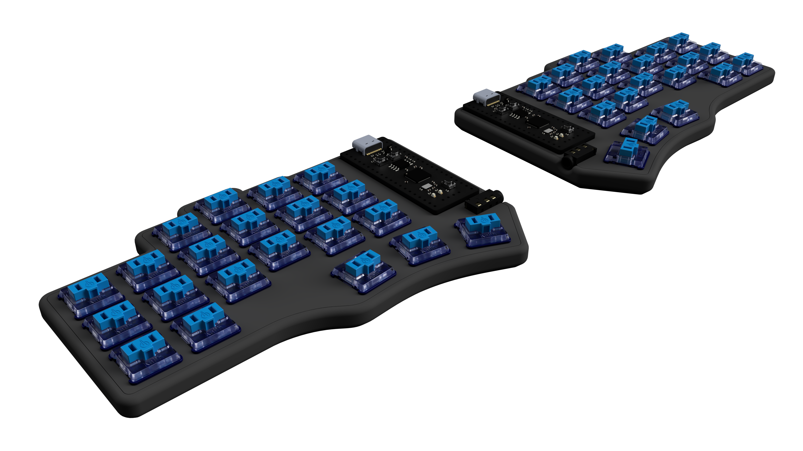

# `tabulator` 🎹

*a compact, minimal, modular case design for the beekeeb Piantor!* (still work in progress)

## 3D files 📦

[check out the live 3D preview here](https://a360.co/3JL0lDt), downloads are enabled! \
also, a full selection of 3d models are available in the [resources](https://github.com/StuSerious/tabulator/tree/master/resources) folder.

## license 📜

 This work is licensed under a <a rel="license" href="http://creativecommons.org/licenses/by-sa/4.0/">Creative Commons Attribution-ShareAlike 4.0 International License</a>, **excluding** the files mentioned in the credit section of the [design](https://github.com/StuSerious/tabulator/tree/master/design#credits-) directory.
